# sEMG_Gestures
### Background
The MYO Thalmic Bracelet is a wearable technology that measures the electrical impulses of forearm muscles. It has 8 channels, each producing signal data associated with a different area of the arm. There are a few potential uses of this kind of bracelet. It may be used for robotic prosthetics, sending commands to a computer, or for virtual reality training or videogames.

### MYO Thalmic Bracelet
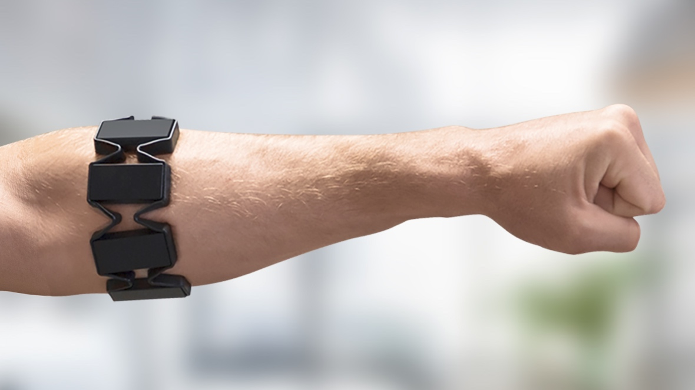

### Intro

There are multiple approaches to viewing this project.

- Examining the efficacy of a universal model of human gesture data per this bracelet. 
- Testing the viability of a training period prior to each user's personal use
- Looking for extractable parameters within the signal data and exploring their attributes

DATA SOURCE: https://archive.ics.uci.edu/ml/datasets/EMG+data+for+gestures \
Structure of data: 36 participants, 2 sessions each, 6 gestures, 2 gesture periods for each gesture in a session\

####Settled Features after testing:
- sampling window: ~100ms
- pseudo-magnitude: Maxval-Minval per channel (most accuracy found here)
- Frequency: Estimation using Welch Power Spectral Density

Gesture chart\
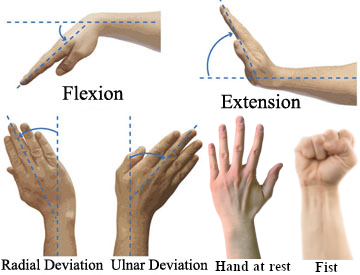

####Best Tested Models:
1 RandomForestClassifier (top performing)
2 ANN (Exported as model.h5)

Different users with particular features (e.g. bodyfat%) result in various perfomance results\
when using a universal model. Two Participants had significant underperformance. In a follow-up research article, the researchers found that these latent features, particularly bodyfat%, had these affects. To continue to develop a better model, an additional protocol to determine bodyfat percentage of the user prior to device use is recommended. A dataset with annotated bodyfat levels should train the model, given the assumption that similar participants produce similar signal data (I believe this is reasonable).

Performance with different withheld participants:\
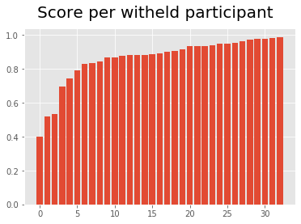

Here are the most common model errors\
KEY: ( 1: 'hand at rest',\
 2: 'hand clenched in a fist',\
 3: 'wrist flexion',\
 4: 'wrist extension',\
 5: 'radial deviations',\
 6: 'ulnar deviations')\
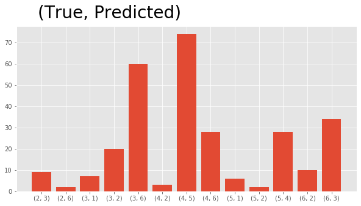
The two top errors stand out as the most "confusing" for the model. The model frequently predicts an ulnar deviation when the user is performing a wrist flexion, and similarly predicts a radial deviation when the user is performing a wrist extension.  
I believe this is explainable by some converging used muscles. I hypothesize the main ones to be the Brachioradialis during the wrist flexion and ulnar deviation confusion and the extensor pollicis, but other additional muscles may be involved for each.

####Raw data section:
Showing example raw data 1 participant\
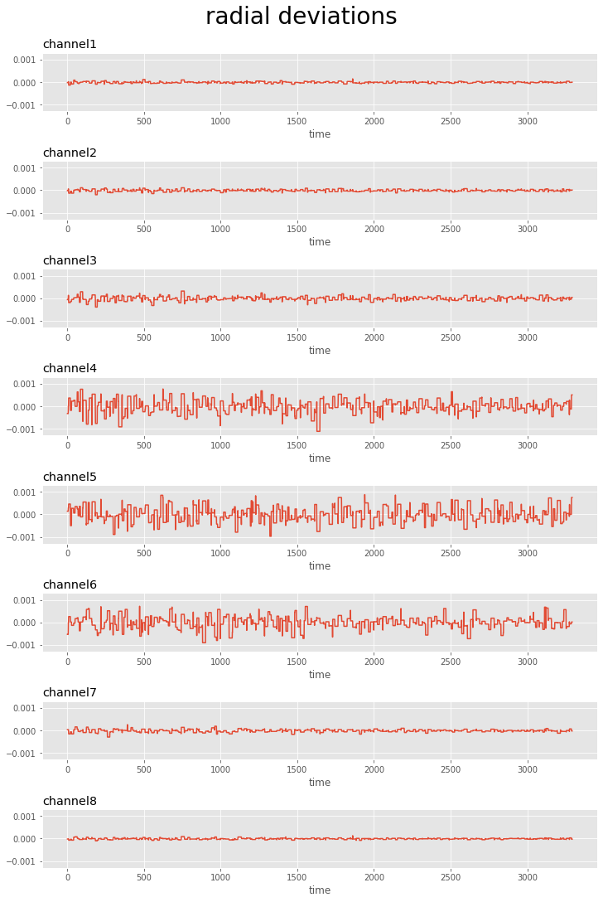\
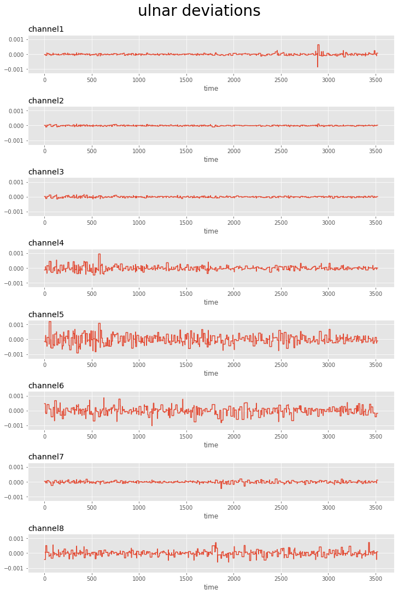\
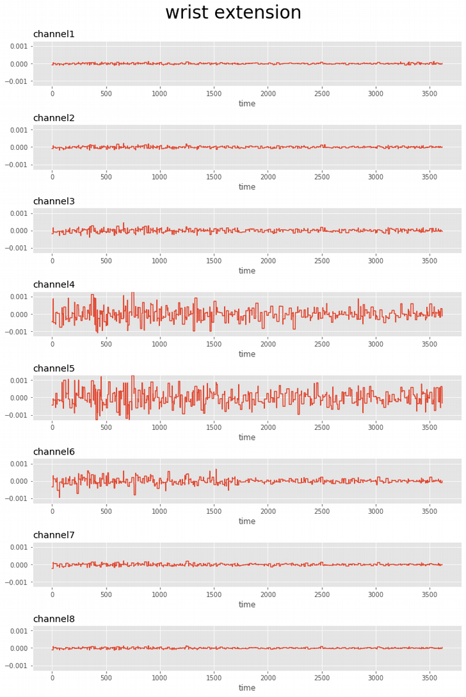\
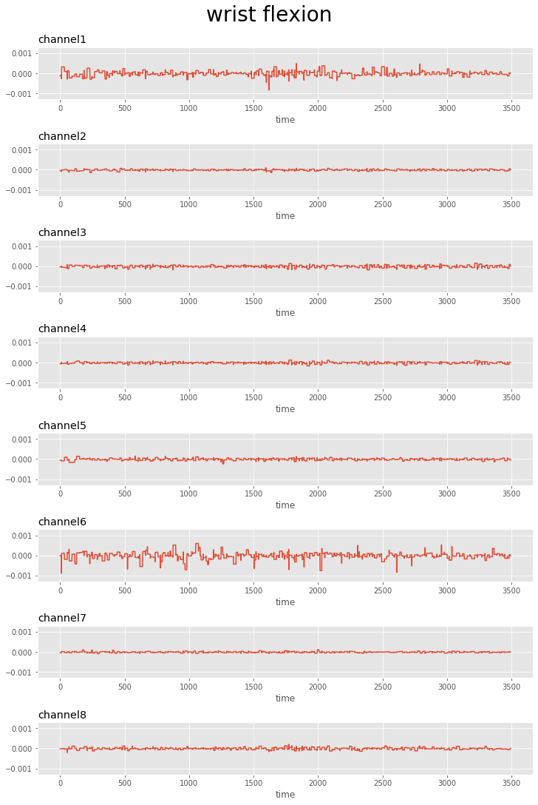\
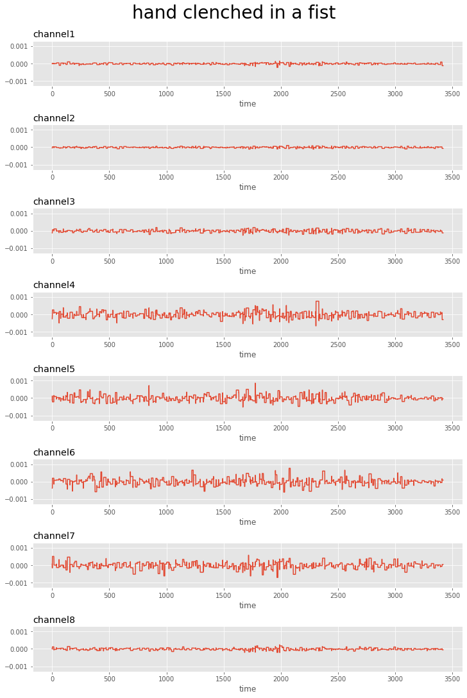\
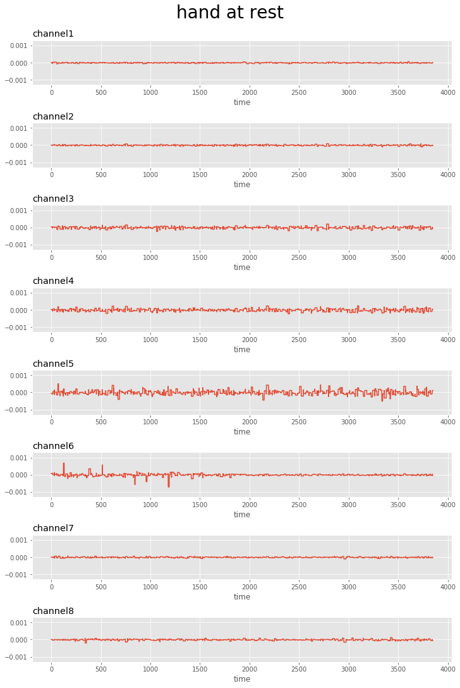\
\
Showing example raw overlayed gestures 1 participant:\
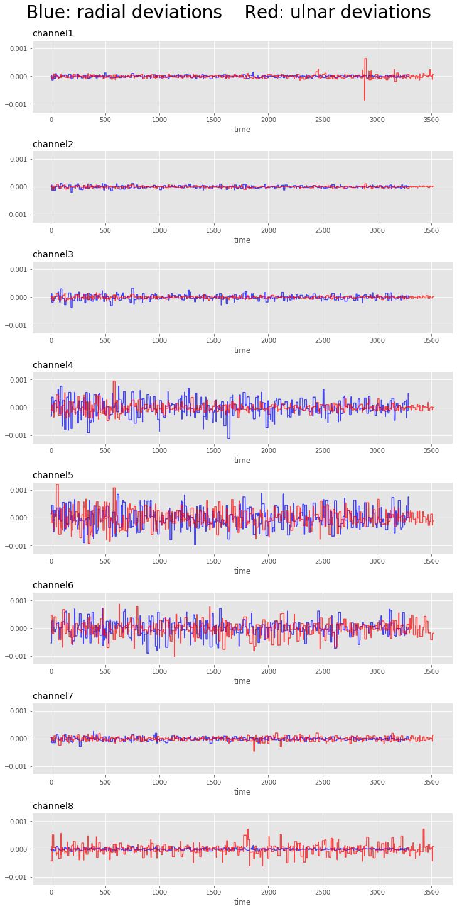\
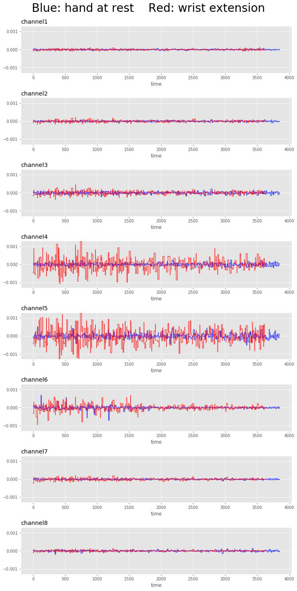\
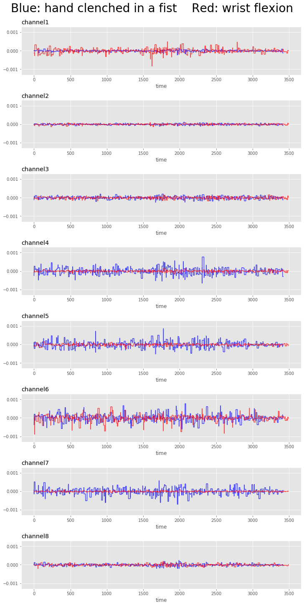\

####Feature Integrity section:

Example of raw participant-participant deviations:\
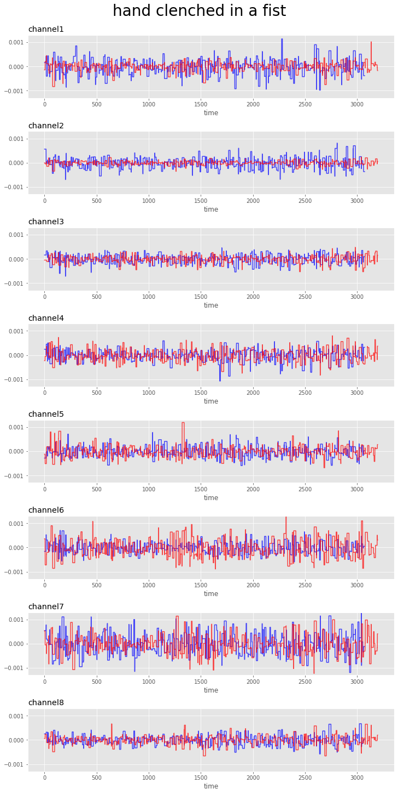

Example The input feature "pseudo-magnitude"'s residual error between two different participants:\
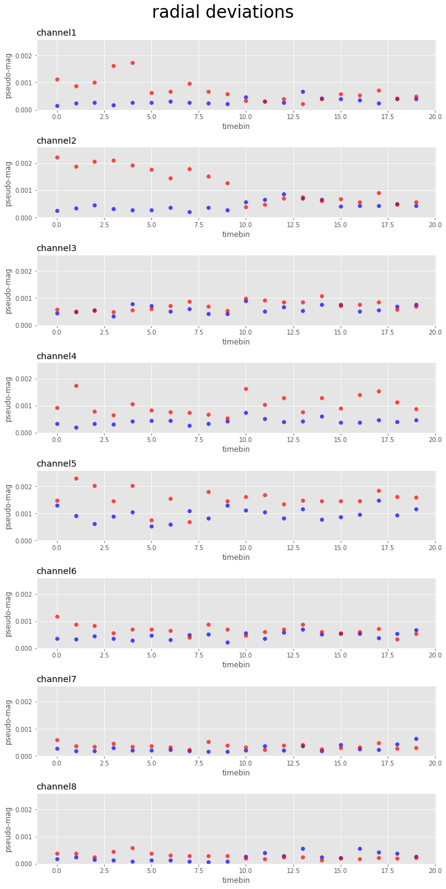
