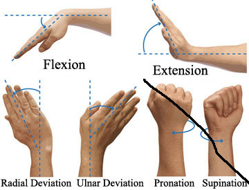

# sEMG_Gestures

## Gestures
\

There are multiple approaches to viewing this project.

- Examining the efficacy of a universal model of human gesture data per this bracelet. 
- Testing the viability of a training period prior to each user's personal use
- Looking for extractable parameters within the signal data and exploring their attributes

DATA SOURCE: https://archive.ics.uci.edu/ml/datasets/EMG+data+for+gestures
Structure of data: 36 participants, 2 sessions each, 6 gestures, 2 gesture periods for each gesture in a session\
\
Settled Features after testing:\
sampling window: ~100ms\
pseudo-magnitude: Maxval-Minval per channel (most accuracy found here)\
Frequency: Estimation using Welch Power Spectral Density\

Some Gestures\
\

Best Tested Models:\
RandomForestClassifier\
ANN\

Different users with particular features (e.g. bodyfat%) result in various perfomance results\
when using a universal model. Two Participants had significant underperformance\
Performance with different withheld participants:\

Here are the most common model errors\
KEY: ( 1: 'hand at rest',\
 2: 'hand clenched in a fist',\
 3: 'wrist flexion',\
 4: 'wrist extension',\
 5: 'radial deviations',\
 6: 'ulnar deviations')\

Showing example raw data 1 participant\
\
\
\
\
\
\
\
Showing example raw overlayed gestures 1 participant\
\
\
\

Example of raw participant-participant deviations\
\

Example Residuals of participant-particiapnt deviatons of magnitude feature\
\
